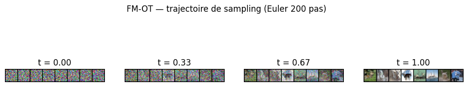
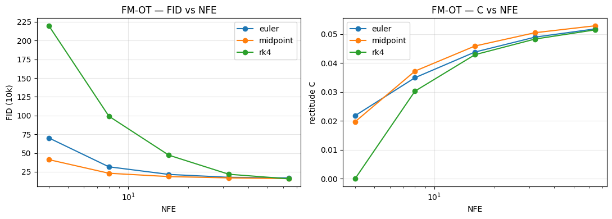
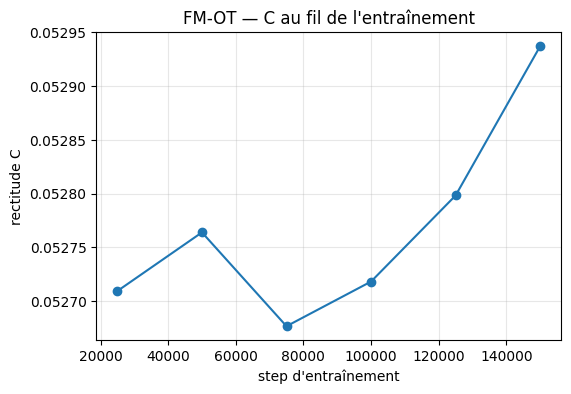

# Flow Matching for Generative Modeling — reproduction réduite sur CIFAR-10 (chemin OT)

> **Projet de validation — *Introduction to Deep Learning* (B3, A. Bouru-Gazeau)**
> Auteur·rice·s : Alexis Arnaud, Thomas Le Bourdon
> Papier reproduit : **Lipman, Chen, Ben-Hamu, Nickel, Le — *Flow Matching for Generative Modeling*, ICLR 2023** ([arXiv:2210.02747](https://arxiv.org/abs/2210.02747))
> Code : [`src/flow_matching_b3/`](../src/flow_matching_b3) · notebooks : [`notebooks/`](../notebooks)
>
> *Ce Markdown est synchronisé avec [`rapport.tex`](rapport.tex) (source du PDF). Les schémas conceptuels sont dessinés en TikZ dans le PDF ; ici ils sont décrits et renvoyés au PDF.*

---

## Note de version (resit)

Cette version resserre le projet sur la conclusion centrale du papier pour **réduire le coût de calcul** et renforcer la théorie :

- **Modèle beaucoup plus petit** : backbone ADM réduit (`adm_unet_cifar10_small`, **6 949 187 paramètres** ≈ 6,9 M, contre 38,3 M initialement).
- **Une seule méthode : FM-OT.** Les chemins VP et DDPM restent dans le code (`paths.py`, tests verts) mais ne sont plus entraînés ni évalués.
- **Une seule ablation : la métrique de rectitude** $C$, sur deux axes (vs NFE/solveur, et au fil de l'entraînement).
- **Explication du papier déroulée** : §2 reprend les dérivations pas à pas (continuité, équivalence FM↔CFM, Théorème 3, spécialisation OT).
- **Schémas** ajoutés (vue générative, conditionnel/marginal, définition de $C$).

Le **protocole de reproduction** (FID `legacy_tensorflow` 50 k, NFE `dopri5`, EMA) est inchangé.

---

## Périmètre de la reproduction (résumé exigé par le sujet)

| Question du sujet | Réponse |
|---|---|
| **Ce qui est reproduit** | La ligne **FM-OT** de la *Table 1* du papier sur CIFAR-10 (FID + NFE) ; la Fig. 4 (toy 2D, trajectoires droites) ; la courbe de FID au cours de l'entraînement ; les trajectoires de sampling FM-OT. |
| **Ce qui est simplifié** | Une seule méthode (FM-OT), un seul dataset (CIFAR-10 32×32) ; **backbone réduit à 6,9 M params** (vs 38,3 M) ; **150 k steps** (vs 391 k) ; FID mi-entraînement sur 10 k échantillons (50 k pour le chiffre final) ; LR schedule warmup + decay linéaire ; pas de likelihood / NLL. |
| **Ce qui est évalué** | FID (`clean-fid`, `legacy_tensorflow`, 50 k samples) ; NFE moyen `dopri5` ; qualité visuelle ; **rectitude des trajectoires** $C$ (§5). |
| **Référence de comparaison** | Le **FM-OT du papier** (FID 6.35, backbone complet). On compare l'*ordre de grandeur* et la *tendance* (rectitude → NFE faible), pas l'égalité absolue, le modèle étant ~5,5× plus petit. |
| **Ablation → hypothèse** | *Rectitude des trajectoires* (§5), deux axes. (A) $C$ et FID vs NFE/solveur → « le champ OT, presque droit, tolère une intégration d'ordre faible à petit NFE ». (B) $C$ au fil de l'entraînement → « le champ marginal appris se redresse vers la droite OT idéale en convergeant ». |

---

## 1. Introduction

Les modèles de diffusion (DDPM, Ho et al. 2020) génèrent des images en inversant un processus de bruitage stochastique. Leur échantillonnage suit une SDE/ODE dont la trajectoire est intrinsèquement **courbe**, ce qui impose des centaines d'évaluations réseau (NFE) pour un bon FID.

**Flow Matching (FM)** reformule le problème comme l'apprentissage direct d'un **champ de vitesses** $v_\theta(x,t)$ qui transporte une gaussienne $p_0 = \mathcal{N}(0, I)$ vers la distribution des données $p_1$ le long d'un *chemin de probabilité conditionnel* $p_t(x \mid x_1)$. L'idée centrale du papier, et **l'angle de notre reproduction** :

> Le choix du chemin conditionnel est un **degré de liberté libre**. En prenant un chemin de **Transport Optimal** (interpolation affine bruit→donnée), on obtient des trajectoires **droites à vitesse constante**, ce qui se traduit par (i) un bon FID et (ii) un **NFE faible**, l'intégration ODE d'un champ droit étant facile.

On reproduit cette affirmation dans un cadre réduit **centré sur FM-OT**, puis on la **quantifie** via une métrique de rectitude reliant géométrie du chemin et coût d'échantillonnage.

---

## 2. Méthode : le papier, déroulé

On note $x_1 \sim q$ une donnée, $x_0 \sim \mathcal{N}(0, I)$ un bruit, $t \in [0,1]$ le temps ($t{=}0$ bruit, $t{=}1$ donnée).

### 2.1 Champ de vitesses, flot et équation de continuité

On cherche un champ $u_t$ dont le flot $\phi_t$, défini par l'EDO

$$\frac{d}{dt}\phi_t(x) = u_t\big(\phi_t(x)\big), \qquad \phi_0(x) = x,$$

transporte $p_0$ vers $p_1 = q$. En notant $p_t$ la densité de $\phi_t(x)$ avec $x \sim p_0$, $p_t$ et $u_t$ sont liés par l'**équation de continuité** :

$$\partial_t p_t(x) + \nabla \cdot \big(p_t(x)\, u_t(x)\big) = 0.$$

On dit que $u_t$ *génère* $p_t$. Générer $q$ revient à trouver $u_t$ générant un $p_t$ qui interpole $\mathcal{N}(0,I)$ et $q$.

*Schéma (PDF, Fig. « vue générative ») : un champ pousse $p_0$ (blob gaussien) vers $p_1$ (clusters de données) ; pour une paire $(x_0,x_1)$, le chemin OT est la droite à vitesse constante, un chemin de diffusion atteint la même donnée par une courbe.*

### 2.2 Du marginal (intraitable) au conditionnel (calculable)

On conditionne sur la donnée $x_1$ via un chemin conditionnel **gaussien**

$$p_t(x \mid x_1) = \mathcal{N}\!\big(x \mid \mu_t(x_1),\, \sigma_t(x_1)^2 I\big), \qquad x_t = \underbrace{\sigma_t(x_1)\, x_0 + \mu_t(x_1)}_{=\,\psi_t(x_0)},$$

avec bornes $\mu_0=0,\sigma_0=1$ (donc $p_0(\cdot\mid x_1)=\mathcal N(0,I)$) et $\mu_1=x_1,\sigma_1\approx0$ (donc $p_1(\cdot\mid x_1)\approx\delta_{x_1}$). La **marginale** reconstruit les données :

$$p_t(x) = \int p_t(x \mid x_1)\, q(x_1)\, dx_1 \;\Longrightarrow\; p_1(x) = q(x).$$

Si $u_t(\cdot\mid x_1)$ génère $p_t(\cdot\mid x_1)$, alors le **champ marginal**

$$u_t(x) = \int u_t(x \mid x_1)\, \frac{p_t(x \mid x_1)\, q(x_1)}{p_t(x)}\, dx_1$$

génère $p_t$ (injecter dans la continuité + linéarité de la divergence). Mais ce champ contient $p_t(x)$ au dénominateur : **intraitable**.

*Schéma (PDF, Fig. « conditionnel vs marginal ») : pour un même $x_0$, plusieurs droites conditionnelles vers $x_1^{(j)}$ ; le champ marginal est leur moyenne pondérée par la postérieure.*

### 2.3 Équivalence des gradients : FM ↔ Conditional FM

On voudrait régresser le champ marginal,

$$\mathcal{L}_{\text{FM}}(\theta) = \mathbb{E}_{t,\, x \sim p_t}\, \big\| v_\theta(x,t) - u_t(x) \big\|^2,$$

intraitable. On régresse plutôt la cible **conditionnelle**, calculable ($x_1\sim q$, $x_0\sim\mathcal N(0,I)$, $x_t=\psi_t(x_0)$) :

$$\mathcal{L}_{\text{CFM}}(\theta) = \mathbb{E}_{t,\, x_1,\, x_0}\, \big\| v_\theta(x_t,t) - u_t(x_t \mid x_1) \big\|^2.$$

**Théorème 2 du papier** : $\nabla_\theta \mathcal{L}_{\text{FM}} = \nabla_\theta \mathcal{L}_{\text{CFM}}$. *Preuve (esquisse).* On développe $\|v_\theta - u\|^2 = \|v_\theta\|^2 - 2\langle v_\theta,u\rangle + \|u\|^2$ ; le dernier terme est indépendant de $\theta$.

- **Terme quadratique** : la loi de $x_t$ est exactement $p_t$, donc $\mathbb{E}_{x_1,x_0}\|v_\theta(x_t,t)\|^2 = \mathbb{E}_{x\sim p_t}\|v_\theta(x,t)\|^2$.
- **Terme croisé** : avec la définition du champ marginal,

$$\mathbb{E}_{x\sim p_t}\langle v_\theta, u_t(x)\rangle = \iint \langle v_\theta(x,t), u_t(x\mid x_1)\rangle\, p_t(x\mid x_1)\, q(x_1)\, dx_1\, dx = \mathbb{E}_{x_1,x_0}\langle v_\theta(x_t,t), u_t(x_t\mid x_1)\rangle,$$

le $p_t(x)$ se simplifiant. Les termes en $\theta$ coïncident → mêmes gradients. ∎

C'est ce qu'implémente [`losses.py`](../src/flow_matching_b3/losses.py) : un unique `flow_matching_loss` = MSE entre $v_\theta(x_t,t)$ et `path.target(...)`.

### 2.4 Le champ conditionnel gaussien : Théorème 3

Le flot conditionnel est l'affine $\psi_t(x_0) = \sigma_t x_0 + \mu_t$. Par définition d'un champ générant un flot, la vitesse au point $\psi_t(x_0)$ est

$$u_t\big(\psi_t(x_0)\mid x_1\big) = \frac{d}{dt}\psi_t(x_0) = \sigma_t'\, x_0 + \mu_t'.$$

On inverse $x_0 = (x-\mu_t)/\sigma_t$ et on substitue :

$$\boxed{\,u_t(x \mid x_1) = \frac{\sigma_t'}{\sigma_t}\,(x - \mu_t) + \mu_t'\,}$$

c'est le **Théorème 3**. Toute la spécificité d'un chemin tient dans $(\mu_t, \sigma_t)$.

### 2.5 Spécialisation au chemin OT : la trajectoire est une droite

Le chemin de Transport Optimal prend

$$\mu_t = t\, x_1, \qquad \sigma_t = 1 - (1-\sigma_{\min})\,t, \qquad \sigma_{\min} = 10^{-4}.$$

Alors $\mu_t' = x_1$, $\sigma_t' = -(1-\sigma_{\min})$. Le long du flot, $x - \mu_t = \sigma_t x_0$, donc $\frac{\sigma_t'}{\sigma_t}(x-\mu_t) = \sigma_t' x_0 = -(1-\sigma_{\min})x_0$, et

$$\boxed{\,u_t(x_t \mid x_1) = x_1 - (1-\sigma_{\min})\, x_0\,}$$

**indépendant de $t$**. La trajectoire $\psi_t(x_0) = \big(1-(1-\sigma_{\min})t\big)x_0 + t\,x_1$ est affine, donc $\psi_t''(x_0) = 0$ : **droite parcourue à vitesse constante**. Géométriquement, $p_t(\cdot\mid x_1)$ est l'*interpolation de déplacement* (OT de McCann) entre $\mathcal N(0,I)$ et $\mathcal N(x_1,\sigma_{\min}^2 I)$. C'est l'origine de l'avantage : un champ aux courbes intégrales conditionnelles droites est facile à intégrer.

### 2.6 Échantillonnage et lien rectitude → NFE

On génère en intégrant $\dot x = v_\theta(x,t)$ de $t{=}0$ à $t{=}1$. Pour un pas d'Euler $h$, l'erreur de troncature locale vaut

$$x_{t+h} - \big(x_t + h\,v_\theta(x_t,t)\big) = \tfrac{1}{2}h^2\, \ddot x(\xi) = \tfrac{1}{2}h^2\, \psi''(\xi),$$

qui s'annule pour un champ droit ($\psi''=0$). **Plus le champ est droit, moins il faut de pas (NFE).** Le champ marginal *appris* n'est pas exactement droit (la moyenne de droites n'est pas une droite) → déviation résiduelle, qu'on **mesure** en §5.

### 2.7 Architecture ([`unet.py`](../src/flow_matching_b3/unet.py))

U-Net **ADM** (Dhariwal & Nichol 2021) réimplémenté, **en version réduite** : ResBlocks GroupNorm + injection FiLM du temps, self-attention à la résolution 16, down/up-sampling par conv. `base_channels=64`, `mult=(1,2,2)` (canaux → 128 à la résolution 16, attention 4 têtes × 32), `depth=2`. **6 949 187 paramètres** (vérifié par `sum(p.numel())`), soit ~5,5× moins que le backbone complet (38,3 M) — d'où la réduction de coût. Le toy 2D utilise un MLP 5×512.

---

## 3. Cadre de reproduction

| Élément | Valeur |
|---|---|
| **Modèle** | U-Net ADM réduit, **6,9 M params** (`adm_unet_cifar10_small`). |
| **Dataset** | CIFAR-10 train (50 000 images 32×32), normalisé $[-1,1]$, flip horizontal aléatoire. |
| **Optim** | Adam $(\beta = 0.9/0.999,\ \varepsilon = 10^{-8})$, `lr_peak = 1e-4`, `wd = 0`. |
| **LR schedule** | warmup linéaire **5 k** steps + decay linéaire jusqu'à $10^{-8}$. |
| **Batch effectif** | 256 = batch physique 64 × `accum_iter` 4. |
| **Steps** | **150 000** (réduit vs 391 k ; modèle plus petit convergeant plus vite). |
| **EMA** | 0.9999 avec warmup de biais ; **l'évaluation se fait sur les poids EMA**. |
| **Précision** | FP32 en éval ; bf16 possible à l'entraînement A100. |
| **$\sigma_{\min}$ (OT)** | $10^{-4}$. |
| **Solveur « Table 1 »** | `dopri5` adaptatif, `atol = rtol = 1e-5` (valeur du papier). |
| **Métrique** | FID `clean-fid`, `mode="legacy_tensorflow"`, **50 k** échantillons. |

**Métrique principale.** Le FID `legacy_tensorflow` est imposé par la comparabilité ; `mode="clean"` donnerait des scores non comparables ([`fid.py`](../src/flow_matching_b3/fid.py)). Le NFE moyen `dopri5` mesure le coût d'échantillonnage.

**Coût.** **Un seul run** FM-OT (150 k steps, 6,9 M) au lieu de 3 × 391 k : budget GPU réduit d'environ un ordre de grandeur.

**Validation amont (notebook 01, toy 2D).** On valide la pipeline sur le « damier » du papier (Fig. 4) : FM-OT reconstruit le damier en ~15 min CPU, trajectoires Euler droites.

**Garde-fous.** `pytest tests/` (vert) vérifie que la cible $u_t$ de chaque chemin égale $\partial_t \psi_t$ par autodiff (tol. $10^{-5}$), et que la rectitude $C$ vaut ≈ 0 sur un champ analytiquement droit et croît sur un champ courbe ([`tests/test_metrics.py`](../tests/test_metrics.py)).

---

## 4. Résultats

> **Note de transparence.** Notebooks commités sans sortie (`nbstripout`). Les valeurs ci-dessous sont **à régénérer** par [`notebooks/02_fm_ot_colab.ipynb`](../notebooks/02_fm_ot_colab.ipynb) après le run Colab du modèle réduit ; laissées en *à compléter* pour ne pas reporter d'anciens chiffres (modèle 38,3 M), invalides ici.

### 4.1 FM-OT — résultat principal

| Modèle | FID (notre repro, 6,9 M) | FID (papier, 38,3 M) | NFE moyen (dopri5) |
|---|---|---|---|
| **FM-OT** (CFM) | *à compléter* | 6.35 | *à compléter* |

**Lecture attendue.** On vise la *tendance* du papier : FID raisonnable et surtout **NFE `dopri5` modéré**, signature d'un champ régulier. L'écart absolu au papier est attendu (modèle 5,5× plus petit, budget de steps réduit).

### 4.2 FID au cours de l'entraînement

FID mi-entraînement (EMA, **10 k** samples → biaisé ↑, relatif), tous les 25 k steps :

| Step (k) | 25 | 50 | 75 | 100 | 125 | 150 |
|---|---|---|---|---|---|---|
| FM-OT | *—* | *—* | *—* | *—* | *—* | *—* |

On attend une décroissance monotone, l'essentiel du gain acquis tôt.

### 4.3 Trajectoires de sampling FM-OT

8 bruits identiques intégrés par Euler (200 pas), états à $t \in \{0, 1/3, 2/3, 1\}$ (généré par le notebook 02_fm_ot_colab, `report/pics/fig_traj_ot.png`). Les structures émergent tôt, cohérent avec un transport quasi-direct.

---

## 5. Ablation : la métrique de rectitude

L'unique ablation de cette version est la **quantification de la rectitude** des trajectoires — la propriété géométrique au cœur de l'avantage OT (§2.5–2.6).

### 5.1 Définition de la métrique $C$

Pour une trajectoire intégrée $\{x_{t_k}\}$ allant de $x_0$ à $x_1$, on définit la déviation moyenne à la corde droite, normalisée :

$$C = \frac{1}{N}\sum_i \frac{1}{K}\sum_k \big\| x^{(i)}_{t_k} - \big[(1-s_k)\,x^{(i)}_0 + s_k\,x^{(i)}_1\big] \big\|_2 \;\Big/\; \big\| x^{(i)}_1 - x^{(i)}_0 \big\|_2,$$

avec $s_k = t_k / t_{\text{end}} \in [0,1]$. Une trajectoire parfaitement droite donne $C = 0$ ; $C$ croît avec la courbure. Implémentée dans [`metrics.py`](../src/flow_matching_b3/metrics.py) (`straightness`), invariante d'échelle.

*Schéma (PDF, Fig. « définition de $C$ ») : on trace la corde $x_0 \to x_1$ et on moyenne les déviations de la trajectoire intégrée à cette corde.*

### 5.2 Axe A — rectitude et FID en fonction du NFE / solveur

**Hypothèse.** Si le champ FM-OT est presque droit ($C$ petit), un intégrateur d'ordre faible à petit NFE doit déjà donner un bon FID (§2.6), et RK4 n'apporterait qu'un gain marginal.

**Protocole.** FM-OT, grille NFE $\{4,8,16,32,64\}$, solveurs Euler / Midpoint(RK2) / RK4 à NFE = nombre d'évaluations réseau. On mesure conjointement $C$ et le FID (10 k samples, biaisé ↑, relatif).

| NFE | 4 | 8 | 16 | 32 | 64 |
|---|---|---|---|---|---|
| FID Euler / $C$ | *—* | *—* | *—* | *—* | *—* |
| FID Midpoint / $C$ | *—* | *—* | *—* | *—* | *—* |
| FID RK4 / $C$ | *—* | *—* | *—* | *—* | *—* |

*(à compléter après le run ; figure générée par le notebook 02_fm_ot_colab, `report/pics/fig_rectitude_nfe.png`)*

**Interprétation attendue.** Un $C$ faible et stable, conjugué à une convergence rapide des solveurs (Euler rattrape RK4 dès NFE ~16), confirmerait le lien *rectitude ⇒ NFE faible* dérivé en §2.6.

### 5.3 Axe B — rectitude au fil de l'entraînement

**Hypothèse.** Au début, le champ appris est imprécis et ses trajectoires courbes ($C$ grand) ; en convergeant, il se **redresse** vers la géométrie droite OT ($C$ décroît).

**Protocole.** $C$ (Euler 100 pas, 512 trajectoires) sur chaque checkpoint (`ckpt_every` = 25 k). Pas de FID → quasi gratuit.

*(à compléter après le run ; figure générée par le notebook 02_fm_ot_colab, `report/pics/fig_rectitude_train.png`)*

**Interprétation attendue.** Une décroissance de $C(\text{step})$ corrélée à celle du FID (4.2) montrerait que l'amélioration de la qualité s'accompagne d'un redressement géométrique — la rectitude comme *diagnostic d'entraînement*, au-delà de l'explication du coût de sampling.

---

## 6. Discussion critique

**Ce qui est attendu.** L'affirmation centrale — chemin OT ⇒ trajectoires droites ⇒ NFE faible — est testée de deux façons indépendantes : l'axe A relie la rectitude au *coût de sampling*, l'axe B à la *dynamique d'entraînement*. La dérivation §2.6 en donne la raison (erreur d'Euler ∝ $\psi''$, nulle pour une droite).

**Limites assumées de la version réduite.**
- **Écart absolu de FID au papier.** Modèle ~5,5× plus petit (6,9 M vs 38,3 M), 150 k steps : le FID absolu sera plus haut. Seuls la *tendance* (NFE faible) et le *comportement de $C$* sont l'objet de la reproduction.
- **Pas de comparaison VP/DDPM.** En se restreignant à FM-OT, on perd la double-ablation « géométrie vs cible » ; la rectitude se lit en *absolu* (valeur de $C$, stabilité en NFE, décroissance à l'entraînement) plutôt qu'en *contraste* entre chemins. Le code VP/DDPM reste disponible.
- **Pas de multi-seed.** Un seul run, pas de barre d'erreur ; la robustesse vient de la cohérence interne (axes A et B pointant la même conclusion).
- **FID mi-entraînement à 10 k** biaisé ↑ : courbes et axe A à lire en relatif.

**Bilan.** Une reproduction *resserrée* : un seul modèle, petit, une seule méthode (FM-OT), une seule ablation — la rectitude — mais traitée en profondeur (définition métrique, deux axes, lien théorique explicite avec coût de sampling et dynamique d'entraînement). Coût de calcul divisé d'environ un ordre de grandeur.

---

## Références

- Lipman, Chen, Ben-Hamu, Nickel, Le. *Flow Matching for Generative Modeling.* ICLR 2023. [arXiv:2210.02747](https://arxiv.org/abs/2210.02747)
- Ho, Jain, Abbeel. *Denoising Diffusion Probabilistic Models.* NeurIPS 2020. [arXiv:2006.11239](https://arxiv.org/abs/2006.11239) — baseline DDPM.
- Dhariwal, Nichol. *Diffusion Models Beat GANs on Image Synthesis.* NeurIPS 2021. [arXiv:2105.05233](https://arxiv.org/abs/2105.05233) — architecture U-Net (ADM).
- Chen, Rubanova, Bettencourt, Duvenaud. *Neural Ordinary Differential Equations.* NeurIPS 2018. [arXiv:1806.07366](https://arxiv.org/abs/1806.07366) — solveur `dopri5` (`torchdiffeq`).
- Parmar, Zhang, Zhu. *On Aliased Resizing and Surprising Subtleties in GAN Evaluation (clean-fid).* CVPR 2022. [arXiv:2104.11222](https://arxiv.org/abs/2104.11222) — protocole FID.
</content>
